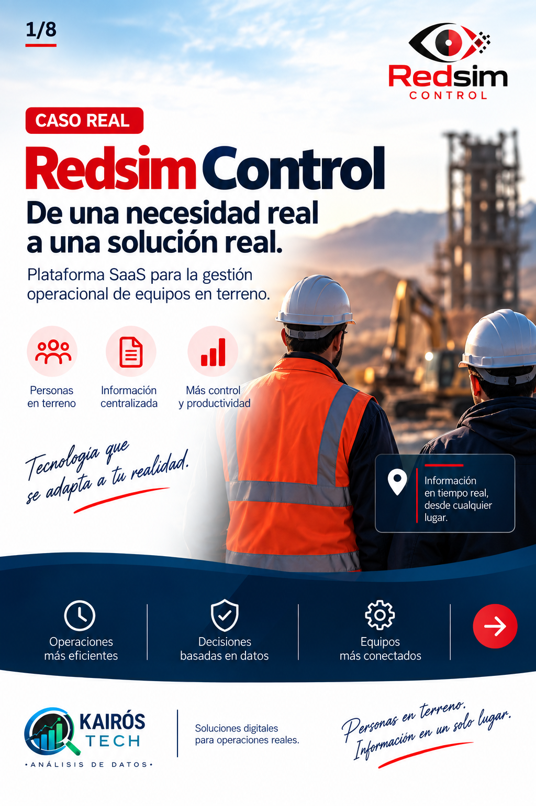
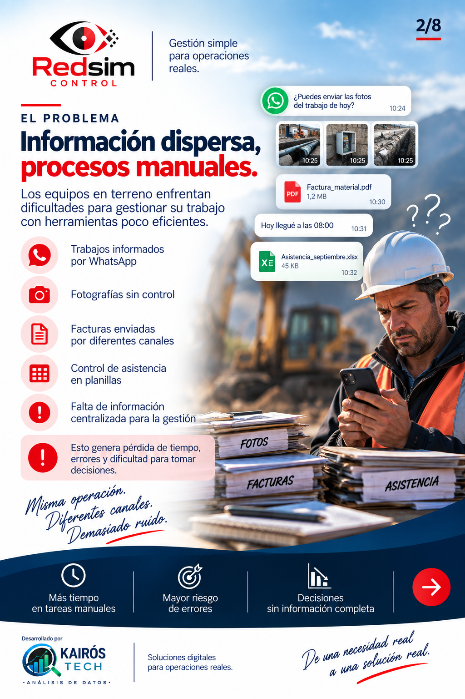
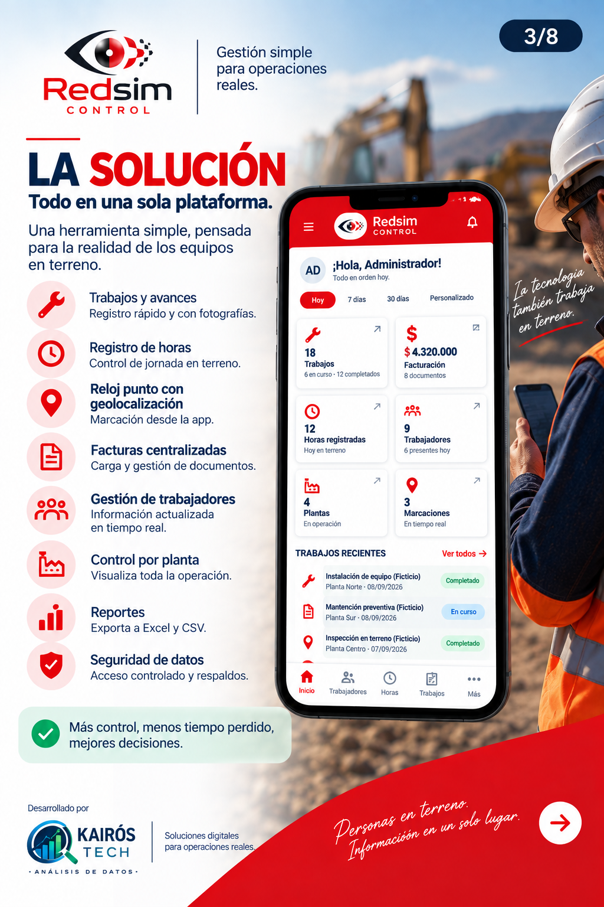
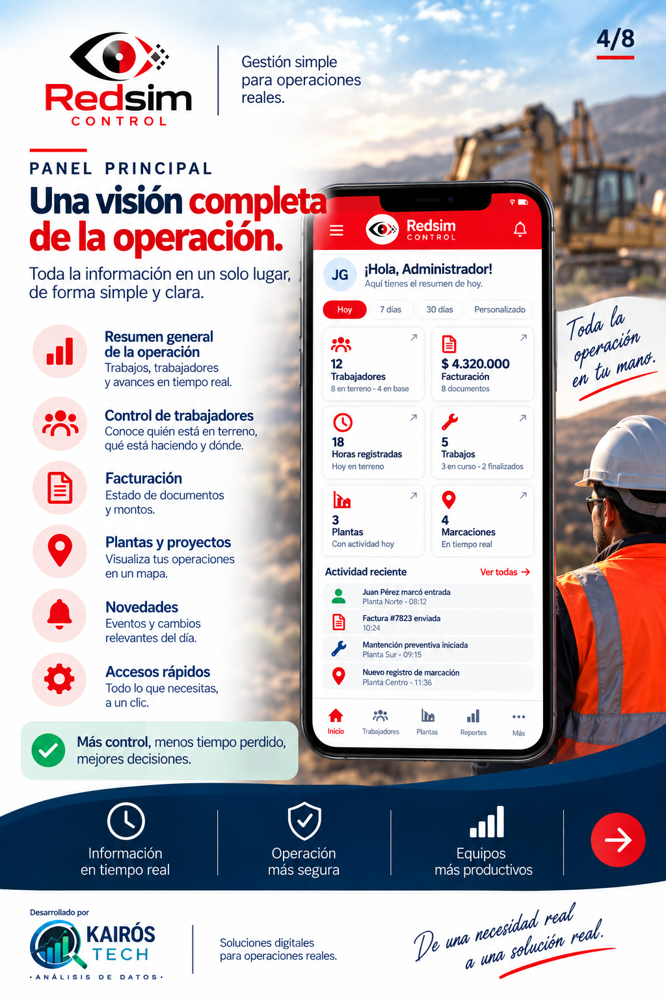
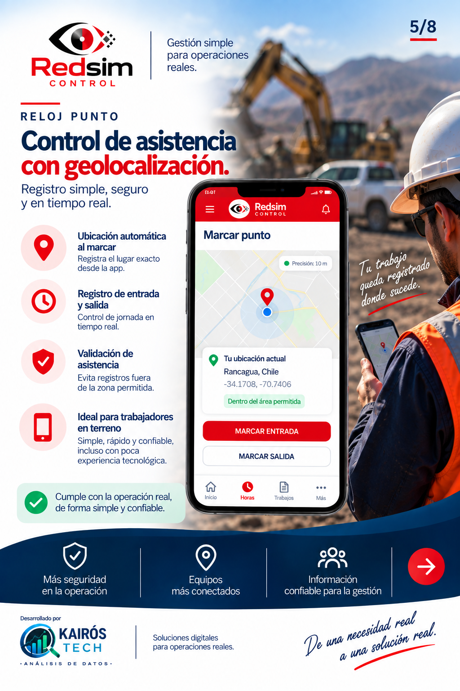
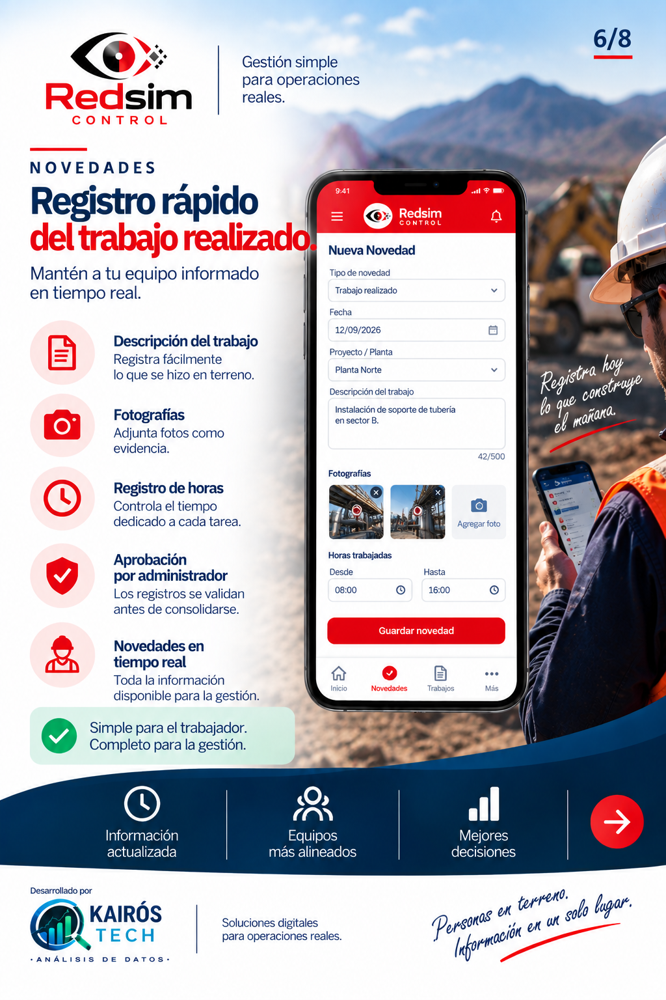
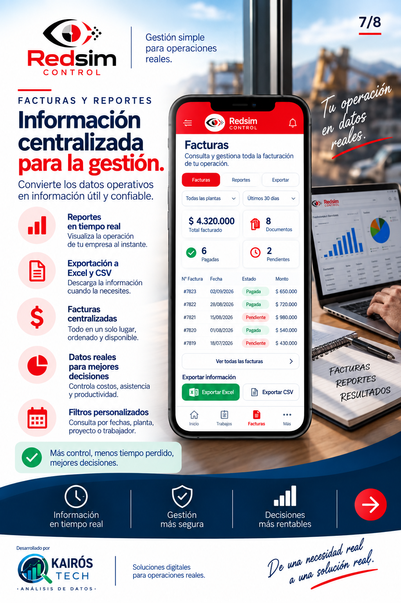
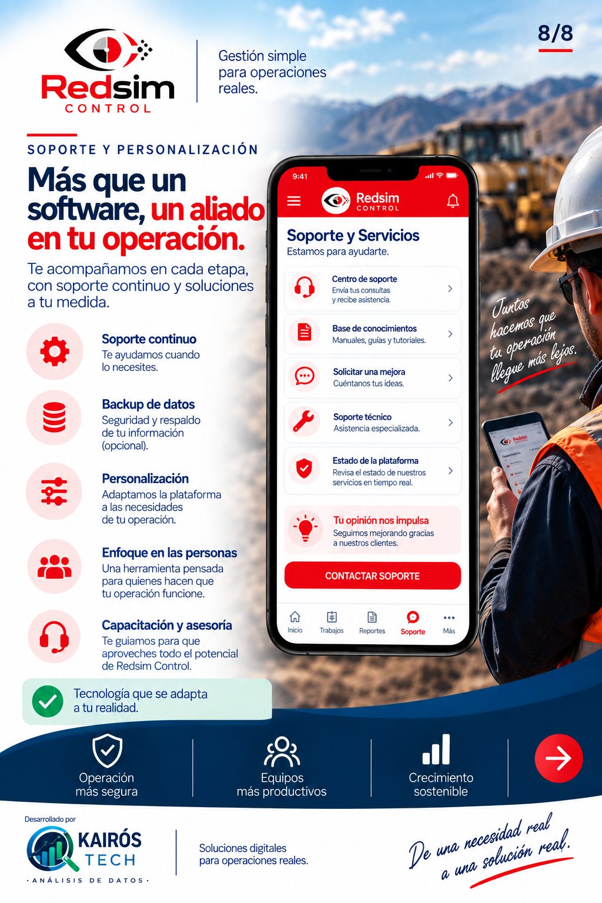

# REDSIM CONTROL

## Case técnico — Plataforma SaaS para gestión operacional

De una necesidad real a una solución real.

REDSIM CONTROL es una plataforma SaaS desarrollada por Kairós Tech a partir de una necesidad real de operación en terreno: transformar información dispersa en una solución centralizada, estructurada y trazable.

## El desafío

En operaciones en terreno, la información puede terminar distribuida entre WhatsApp, fotografías, planillas y registros manuales.

El desafío no era solamente reemplazar una planilla.

Era construir una solución que pudiera adaptarse a las personas que trabajan en terreno y, al mismo tiempo, entregar información organizada para la gestión.

## Las personas primero

No todos los trabajadores tienen el mismo nivel de familiaridad con la tecnología.

Por eso, REDSIM CONTROL fue diseñado buscando una experiencia simple, clara y directa.

La tecnología debía adaptarse a las personas y a la realidad de la operación.

## La solución

REDSIM CONTROL centraliza la gestión operacional en una única plataforma.

Principales áreas:

- Gestión de funcionarios
- Empresas y plantas
- Trabajo y seguimiento operacional
- Reloj punto con geolocalización
- Novedades
- Ausencias
- Facturas
- Informes
- Configuración
- Control de acceso

## Seguridad

La seguridad fue considerada desde la arquitectura de la solución.

Implementaciones principales:

- Autenticación
- Control de acceso por perfiles
- Aislamiento de información por empresa
- Row Level Security (RLS)
- PostgreSQL
- Supabase Auth

## Stack tecnológico

| Tecnología | Uso |
|---|---|
| React | Interfaz de usuario |
| TypeScript | Desarrollo tipado |
| Vite | Build y desarrollo |
| Supabase | Backend y servicios |
| PostgreSQL | Base de datos |
| Supabase Auth | Autenticación |
| RLS | Seguridad y aislamiento de datos |
| PWA | Experiencia adaptada a dispositivos móviles |

## Experiencia móvil

REDSIM CONTROL también fue pensado para dispositivos móviles, permitiendo una experiencia adaptada a trabajadores que realizan parte de su actividad en terreno.

## Resultado

El objetivo es transformar información operacional dispersa en información estructurada, trazable y disponible para la gestión y la toma de decisiones.

## Mi participación

Fantini Alcaras Pelegrini

Software Developer  
Kairós Tech

Este proyecto representa mi primer caso real de desarrollo dentro de Kairós Tech.

Participé en la construcción de una solución orientada a una necesidad real del negocio, trabajando en la definición de funcionalidades, experiencia de usuario, desarrollo de la aplicación, integración con backend, autenticación y seguridad de datos.

## Aprendizaje principal

No comencé por la tecnología. Comencé por entender el problema.

Una buena solución comienza entendiendo a las personas, la operación y la necesidad real que existe detrás del producto.

## Nota sobre el proyecto

Este repositorio es un case study público creado para presentar el proyecto y sus decisiones técnicas.

El código fuente de la plataforma REDSIM CONTROL real permanece en un repositorio privado por razones de seguridad y confidencialidad.

No se incluyen datos reales de trabajadores, credenciales, información sensible ni código privado del cliente.
---

## Galería del proyecto

### 01 — REDSIM CONTROL

  

### 02 — El problema

  

### 03 — La solución

  

### 04 — Panel principal

  

### 05 — Reloj punto con geolocalización

  

### 06 — Novedades

  

### 07 — Facturas y reportes

  

### 08 — Soporte y personalización

  

---

## Demo

Demo visual de REDSIM CONTROL con datos ficticios, creada exclusivamente para presentación del case.

[Ver demo en video](./redsim-control-demo-github.mp4)

El código fuente real permanece privado por motivos de seguridad y confidencialidad.
---

## Nota de confidencialidad

Este repositorio presenta exclusivamente el case técnico y materiales demostrativos.

No se incluyen datos reales de trabajadores, credenciales, información sensible ni el código fuente privado del proyecto.
